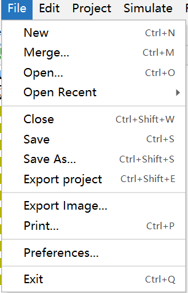
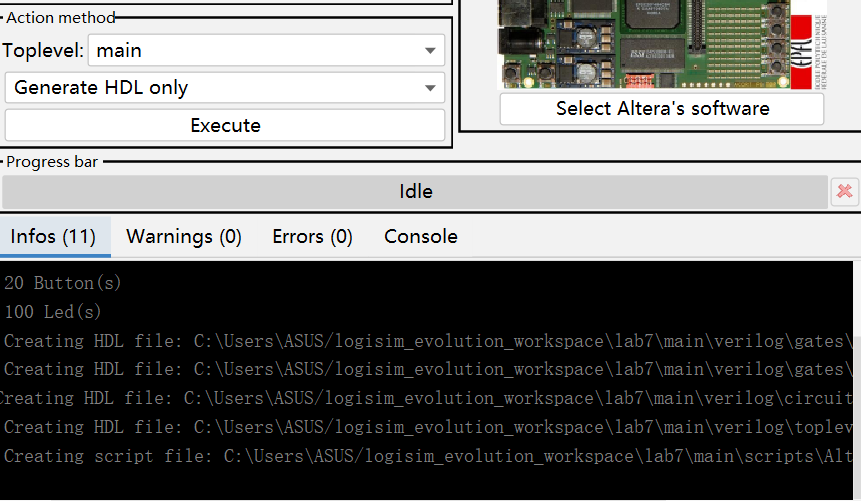

# Lab4 :Method for Using the Logisim and Vivado

**When we learn the Logic and Computer Fundermetal, using of the experiment tools is important. Here are the use of the experiment tools.**

[TOC]
## Chapter 1: Using of Logisim
### 1.1 Download Logisim Evolution
  Logisim is a software that can help us make a circuit diagram in a more intuitional way(<a href="https://de.wikipedia.org/wiki/Logisim">Logisim Introduction </a>). We can create our own circuit diagram to simulate the real circuit.

  There are many ways to download Logisim Evolution. You can download it in its website and it`s easy to search it. Here is the download URL:<a herf="https://github.com/logisim-evolution/logisim-evolution">github</a>. Also, you can download it directly from the file I provide.

  When you download the .zip file, unpack it and find the executable program(~.exe). Click it and you will download it.

  It's important that Logisim Evolution's some functions need Java environment, so you should download and set <a href="https://www.java.com/zh-CN/">Java</a> environment.

### 1.2 Recognize the Interface
  When you open the Logisim Evolution you have downloaded, your interface might be like this:
  If your interface is the same as mine, then you can learn to use it!(Here is only a brief method to use it)
#### 1.2.1 Menu
  As you can see, there are many options in the menu. What are they used for?
  + File:
  "File" option includes many options that are related to the file operations. For example: save files, create files, open files, etc.
  
  Export Image is a good function. It can export your circuit diagram in all kinds of image format like .jpg. It is convenient when you need to submit the your report.

  + FPGN:
  If you have learned the courses about electrinic information, you may konw what it means(If you don't know, it doesn't matter because I don't know, too). It can translate your ciucuit diagram into verilog, which can be exported into Vivado to finish our program.
  
  When you finish your circuit diagram, please click the "Synthesize & Download"(It needs Java environment). 
  Before you click the "Execute" button, you should reset it as your university's requirement. I will take Zhejiang University's requirement for example(I'm major in CS).
</b>
  Click the "Target board" button and choose "FPGA4U".
</b>
  Click the "Settins" button and "FPGA Commander Settings" button:
  Select the "Verilog" under the "Browse" button if your option is "VHDL".
</b>
  Then you can click the "Execute" button and "Done" button.
 </b> 
  Mention that when you can't find the verilog files, you can find it in the log.
  Then you can find the verilog dir.

#### 1.2.2 Making Your Circuit Diagram</b>
  Before make our ciucuit diagram, we should recgonize the companents first.
  
  > + And Gate
  
  >+ Or Gate
  
  >+ Not Gate
  
  >+ Xor Gate
  
  >+ NAND Gate
  
  >+ XOR Gate
  
  >+ And there are more functions:
  
  > 1. The finger image is to help you simulate your circuit diagram(click the input you want to simulate and it will change to 0, 1 or x).
  > 2. The arrow is to select the companents or move it.
  > 3. The line is to create a line between two companents and create node.
  > 4. The letter "A" is to tag your companents.