# Lab4 :Method for Using the Logisim and Vivado

**When we learn the Logic and Computer Fundermetal, using of the experiment tools is important. Here are the use of the experiment tools.**

[TOC]
## Chapter 1: Using of Logisim
### 1.1 Download Logisim Evolution
  Logisim is a software that can help us make a circuit diagram in a more intuitional way(<a href="https://de.wikipedia.org/wiki/Logisim">Logisim Introduction </a>). We can create our own circuit diagram to simulate the real circuit.

  There are many ways to download Logisim Evolution. You can download it in its website and it`s easy to search it. Here is the download URL:<a herf="https://github.com/logisim-evolution/logisim-evolution">github</a>. Also, you can download it directly from the file I provide.

  When you download the .zip file, unpack it and find the executable program(~.exe). Click it and you will download it.

  It's important that Logisim Evolution's some functions need Java environment, so you should download and set <a href="https://www.java.com/zh-CN/">Java</a> environment.

### 1.2 Recognize the Interface
  When you open the Logisim Evolution you have downloaded, your interface might be like this: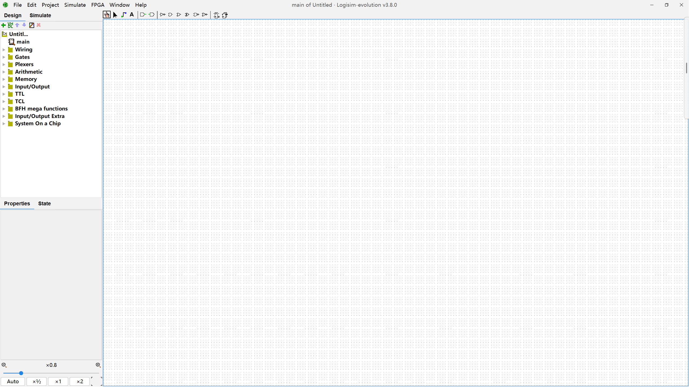
</b>  
  If your interface is the same as mine, then you can learn to use it!(Here is only a brief method to use it)
#### 1.2.1 Menu
  As you can see, there are many options in the menu. What are they used for?
  + File:
  "File" option includes many options that are related to the file operations. For example: save files, create files, open files, etc.
  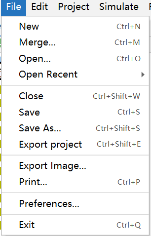
</b>  
  Export Image is a good function. It can export your circuit diagram in all kinds of image format like .jpg. It is convenient when you need to submit the your report.

  + FPGN:
  If you have learned the courses about electrinic information, you may konw what it means(If you don't know, it doesn't matter because I don't know, too). It can translate your ciucuit diagram into verilog, which can be exported into Vivado to finish our program.
  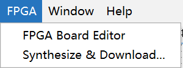
</b>  
  When you finish your circuit diagram, please click the "Synthesize & Download"(It needs Java environment). 
</b>  
  Before you click the "Execute" button, you should reset it as your university's requirement. I will take Zhejiang University's requirement for example(I'm major in CS).
</b>  
  Click the "Target board" button and choose "FPGA4U".
</b>  
  Click the "Settins" button and "FPGA Commander Settings" button: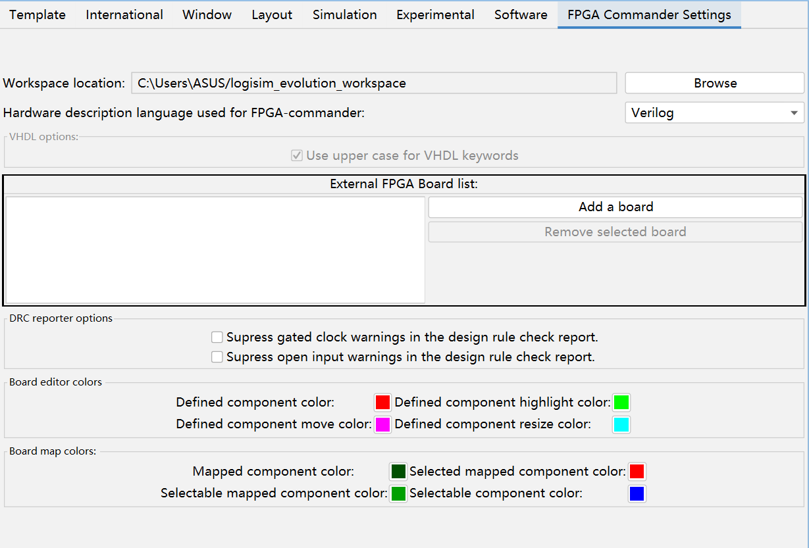
</b>  
  Select the "Verilog" under the "Browse" button if your option is "VHDL".
</b>  
  Then you can click the "Execute" button and "Done" button.
</b>  
  Mention that when you can't find the verilog files, you can find it in the log.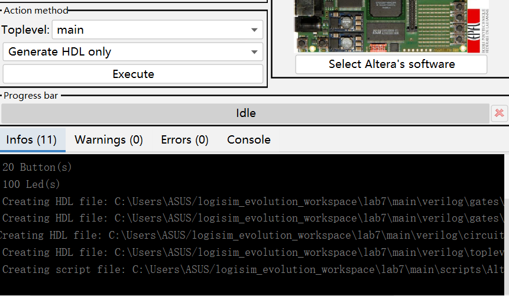
</b>  
  Then you can find the verilog dir.

#### 1.2.2 Making Your Circuit Diagram</b>
  + Before make our ciucuit diagram, we should recgonize the companents first.
  
  > + And Gate
  
  >+ Or Gate
  
  >+ Not Gate
  
  >+ Xor Gate
  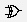
  >+ NAND Gate
  
  >+ XOR Gate
  
  >+ And there are more functions:
  
  > 1. The finger image is to help you simulate your circuit diagram(click the input you want to simulate and it will change to 0, 1 or x).
  > 2. The arrow is to select the companents or move it.
  > 3. The line is to create a line between two companents and create node.
  > 4. The letter "A" is to tag your companents.
  + There is an important companent:Spilter(多位选择器). It is vital to your program.
  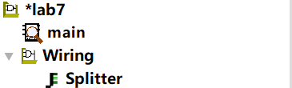
</b>  
  + The properties menu is also important. It define all companents in the circuit diagram.
  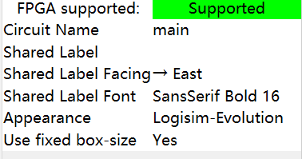
</b>  
  + When you select the circuit companents, it will show these options.
  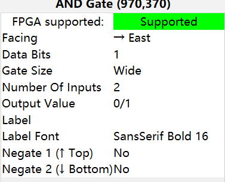
</b>  
  + Here is an example diagram and you can try it.
  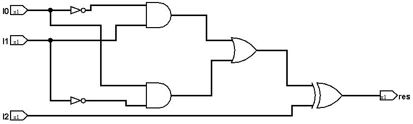
</b>  

## Chapter 2: Using of Vivado
### 2.1 Download Vivado
  <a href="https://en.wikipedia.org/wiki/Vivado">Vivado</a> is a software that helps us born our circuit diagram on the board(my English ability is poor). And we can simulate the circuit by our program.

  To download the Vivado, you need adequate space because it needs lots of space(I have  used 100G space).And here is the website to download it.<a href="https://www.xilinx.com/products/design-tools/vivado.html">https://www.xilinx.com/products/design-tools/vivado.html</a>

### 2.2 Using of Vivado
#### 2.2.1 Create Your Vivado Project
  When you finish your Vivado downloading, you can click the Vivado to use it.
  In the interface, you will see the options like this:
  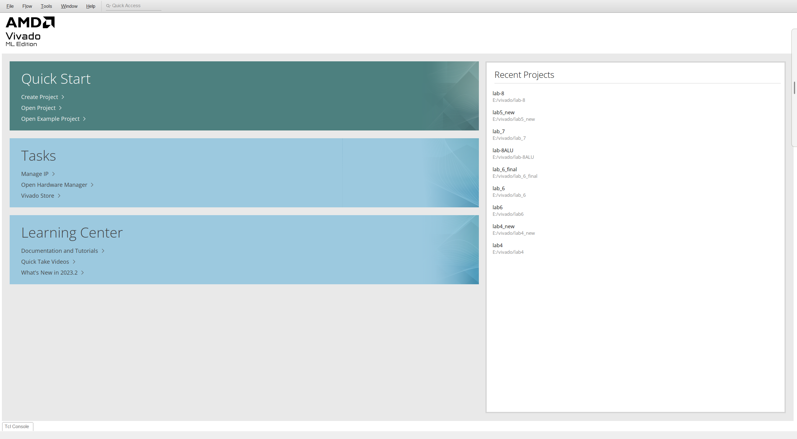
  Choose Quick Start->Create Project, and you will meet the interface:
  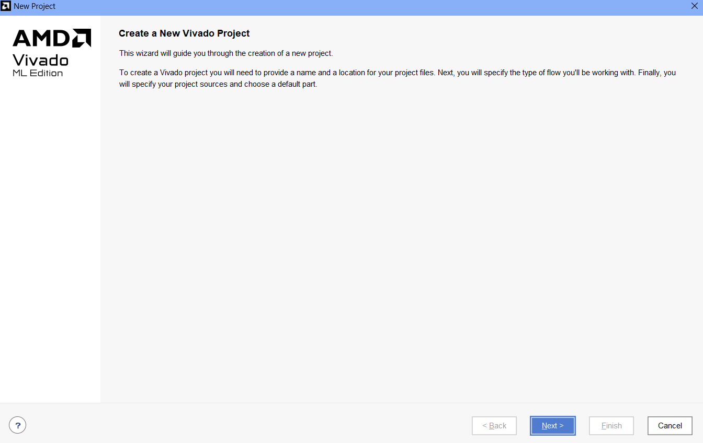
  Then what you need to do is easy: just click the "Next" button(remember to set your project name). But you should be careful that there may be something your university requires to set. I will take my university for exmaple again:
  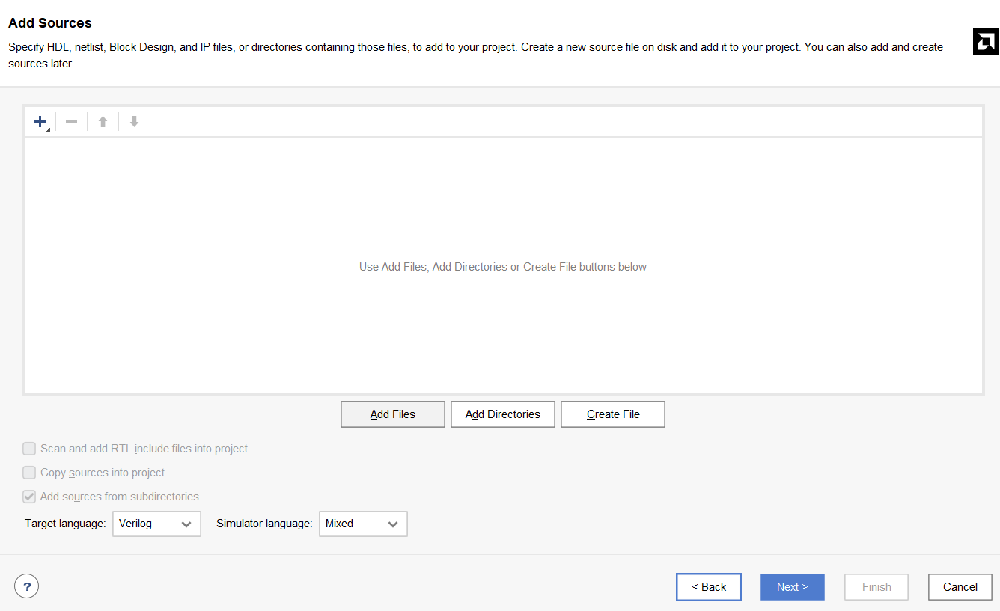
  The target language should be verilog.
  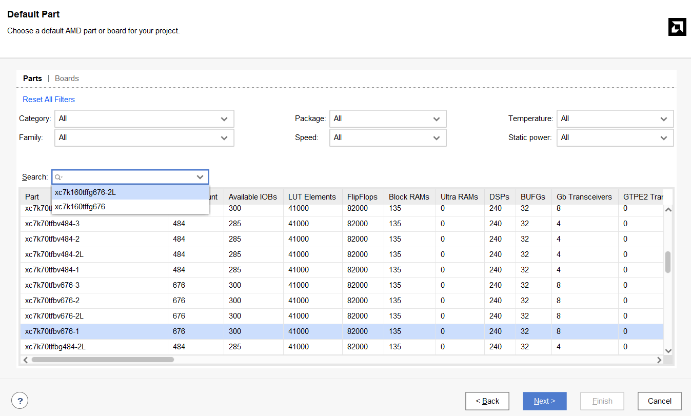
  Search "xc7k160tffg676-2L" and select it and then you can proceed to click "Next".

#### 2.2.2 Kown Your Vivado
  When you enter your Vivado project, you will see the interface as follows(I have export my verilog files):
  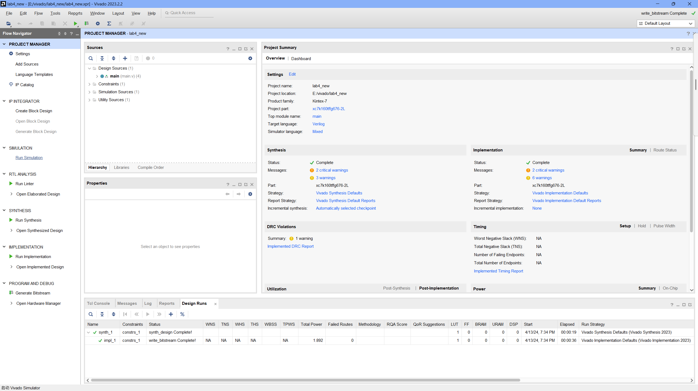
  
