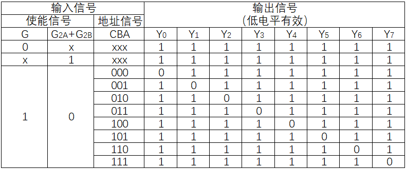

# Lab5 :Decorder(译码器)
**<a href="https://en.wikipedia.org/wiki/Decoder">Decorder</a> is a combinational logic circuit. It can transform a binary input signal into a specific output. We will realize a binary decorder in the experiment.**

- [Lab5 :Decorder(译码器)](#lab5-decorder译码器)
  - [Chapter 1: Binary Decorder](#chapter-1-binary-decorder)
    - [1.1 Theory](#11-theory)
    - [1.2 74LS138 Core](#12-74ls138-core)
      - [1.2.1 Enable Signal](#121-enable-signal)
      - [1.2.2 Address Signal](#122-address-signal)
  - [Chapter 2: Make Circuit Diagram](#chapter-2-make-circuit-diagram)
    - [2.1 What We Need](#21-what-we-need)
      - [2.1.1 Splitter](#211-splitter)
      - [2.1.2 DIY Your Own Companents](#212-diy-your-own-companents)
    - [2.2 Realize 74LS138](#22-realize-74ls138)

## Chapter 1: Binary Decorder
### 1.1 Theory
  For a binary decorder, every binary input is connected to a output, and there must be one output line.

  For a <u>N - $2^N$ decorder</u>, for example, it will input 3 binary signal and output 8 binary signal. There will be <u>only one signal</u> that is available.

  In the circuit, we can set whether <u>high level or low level siganl</u> is valid. In this experiment, we will use <u>low level signal</u> to be valid signal.

### 1.2 74LS138 Core
  74LS138 core is a kind of 3 - 8 decorder. The main enable inputs are G, G2A and G2B; the inputs are A, B and C (A is the lowest bit of the address signal, the first number); the outputs are Y0 ~ Y7. Here is the diagram:
    
  The truth table is here, too.
    

#### 1.2.1 Enable Signal
  The 74LS138 has three enable signals: G, G2A, and G2B. Among them, the G signal is the <u>primary enable signal</u> with high-level effectiveness. When it is at a <u>low level</u>, all output signals are in the <u>inactive state (high level)</u>.

  The two "redundant" enable signals can serve practical purposes. For instance, when using the 74LS138 as a <u>data distributor (or multiplexer)</u>, setting G2B to a low level allows the output level of the corresponding output port for the address signal to match that of G2A.

  Similarly, when aiming to use two 74LS138 chips to form a 4-to-16 decoder, one can employ one of the two signals to allocate the high half of the address and the other for the low half, while retaining the role of the main enable signal G. If only one G enable signal is used, it would be employed to differentiate between high and low addresses, necessitating additional logic to achieve the role of the main enable signal.

#### 1.2.2 Address Signal
  We agree that the A signal represents <u>the lowest bit of the address signal</u>, while C represents <u>the highest bit of the address signal</u>. For example, if the signals A, B, and C have values 0, 1, and 1 respectively, the address we express is b110, which corresponds to selecting Y6(0).

## Chapter 2: Make Circuit Diagram
### 2.1 What We Need
#### 2.1.1 Splitter
  When a signal has multiple lines, we may need a splitter to split it into multiple lines or gather from multiple sources. In the Logisim Wiring library, the splitter provides some properties, and we mainly focus on the following points:

  > + Facing and Appearance: These properties specify the orientation and appearance of the device in the circuit diagram, ensuring the aesthetic of the circuit diagram and adjusting according to actual needs.
  > + Fan Out: This refers to the number of output ports of the splitter, determining how many parts the original signal will be split into.
  > + Bit Width In: This property indicates the bit width of the input signal.
  > + Bit 0/1/...: These options are used to select which port each split bit will go to.

  By adjusting these properties, multiple-line signals can be effectively handled, ensuring the correctness and feasibility of circuit design.
    

#### 2.1.2 DIY Your Own Companents
  When we need to use a circuit for many times, it will be tiring to recreate them one by one. So adding multiplex circuits is important.

  For the former diagram, we could use it as follows:
  > + Click the project name (in the picture"lab5") with the right button of your mouse and click "Add Circuit", then create a new circuit. Mention that the name can not be same as your circuits name that exit :
     
  > + Click the circuit that is created with the right button of your mouse to set it the main circuit.
    
  > + Click the circuit that is created before, then you can add it to your new circuit.
    

### 2.2 Realize 74LS138

  ***Waning: the names of all companents must be same as the circuit I give.***
  
  Rename your circuit name <u>"D_74LS138"</u> and finish the circuit(I have given in this markdown). Create a new project in Vivado, import the code from D_74LS138/verilog/circuit/ and D_74LS138/verilog/gates/ directories into the project, and simulate the generated Verilog code using [simulation files](D_74LS138_tb.v).

  **If you forget the process, please look up in [lab4](Introduction.md).**
