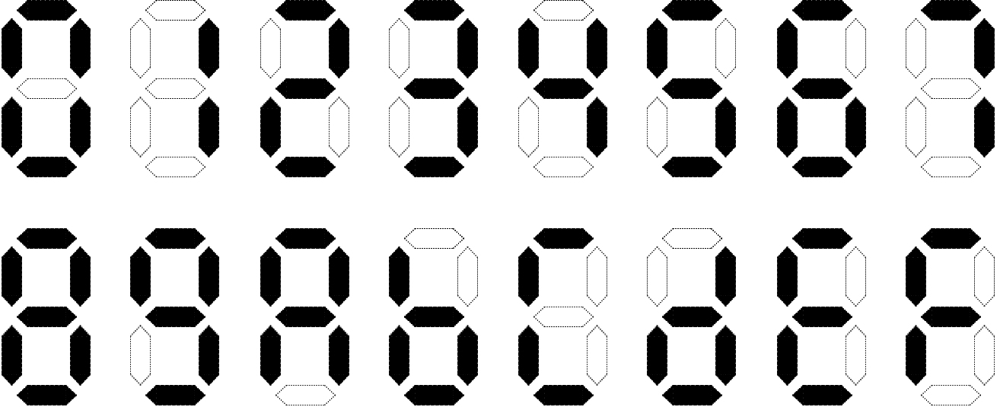

# Lab 6 :Seven-segment Digital Tube
**Seven-segment digital tube is common in our life. Lab6 will show you how it works.**

- [Lab 6 :Seven-segment Digital Tube](#lab-6-seven-segment-digital-tube)
  - [Chapter 1: Seven-segment Digital Tube](#chapter-1-seven-segment-digital-tube)
  - [Chapter 2: MC14495](#chapter-2-mc14495)
    - [2.1 Introduction](#21-introduction)
    - [2.2 Realization](#22-realization)
  - [Chapter 3: Using of MyMC14495](#chapter-3-using-of-mymc14495)


## Chapter 1: Seven-segment Digital Tube

  Seven-segment digital tube is consisted of seven LED. The seven LEDs are named a, b, c, d, e, f, g and a point p.
  <br /><br />
  Seven-segment digital tube can translate the output signals into the numbers people can realize. For example the hexadecimal digit(十六进制数字).
  <br /><br />
  Mention that LED will be lighted only if the output is 0(low level signal is valid)

## Chapter 2: MC14495
### 2.1 Introduction
  The combination component we want to implement has the following ports:
  <br /><br />
  > D0 ~ D3: 4 bit width input
  > LE: enable signal(low level signal is valid)
  > point: whether point is lighted(high level signal is valid)
  > a ~ g, p: output signal, low level signal is valid.

  If we want to realize the circuit, we need to know the boolean expression. We can list the truth table to help us realize it:
  <br /><br />

  > e = $\overline{D3D2D1}$D0 + $\overline{D3D2}$D1D0 + $\overline{D3D1D0}$D2 + $\overline{D3}$D2D1D0 + D3$\overline{D2D1}$D0

  Or you can use Karnaugh map to simplify:
  > e = $\overline{D3}$D0 + $\overline{D3D1}$D2 + $\overline{D2D1}$D0

### 2.2 Realization
  Know we know the theroy of the circuit, we can realize it in our circuit diagram. Here is the diagram:
  <br /><br />

  It is obvious that the diagram is difficult to realize. So that we know the boolean expression, we can use <a href="https://en.wikipedia.org/wiki/Verilog#:~:text=Verilog%2C%20standardized%20as%20IEEE%201364,register%2Dtransfer%20level%20of%20abstraction.">verilog</a> to realize it directly.

  If you want to realize in verilog, I will give you the module and port definitions.
  ```
  module MyMC14495{
    input wire D0, D1, D2, D3,
    input wire LE,
    input wire point,
    output reg p,
    output reg a, b, c, d, e, f ,g
  };
    //Your code.
  endmodule
  ```
  Of course I will give you the [text](MyMC14495.v) in the file.

  After realize the circuit diagram, you can simulate it. Here is the [simulation file](MyMC14495_tb.v).

## Chapter 3: Using of MyMC14495
  Here's a simple encapsulation of the recently implemented MyMC14495 into a module called DispNum. It utilizes one button to control the enable signal LE, another button to control the decimal point, four switches to represent input digits, and four switches to directly control the illumination of the seven-segment displays (AN signals) on the Arduino. The port descriptions for this module are as follows:

  > + Input Ports:
>   
    >   + BTN[1:0]: Two buttons in the same row of the button array.
    >   + SW[7:0]: Eight switches on the right half of the board.
> 
  > + Output Ports:
> 
    >   + SEGMENT[7:0]: Seven-segment displays (including the decimal point).
        >   + SEGMENT[7] is connected to 'p'.
        >   + SEGMENT[0]~SEGMENT[6] are respectively connected to 'a', 'b', 'c', 'd', 'e', 'f', 'g'.
    >   + AN[3:0]: Used to directly control the illumination of the four seven-segment displays.
    >   + BTN_X is constantly set to 0, selecting a row in the button array.
  
  Here is the diagram:
  <br /><br />

  If you want to realize it in verilog, here is the module and ports definations:
  '''
  module DispNum{
    input wire [1:0] BTN,
    input wire [7:0] SW,
    output wire [7:0] SEGMENT,
    output wire [3:0] AN,
    output wire BTN_X
  };
    //Your code.
    MyMC14495 MyMC14495_inst{
        .D0(),    //fill the blank
        .D1(),
        .D2(),
        //fill the next content
    }
  endmodule
  '''

  Also, the [verilog code](DispNum.v) is here.

  If your simulation result is right, here is the [constraints file](constraints_lab6.xdc).

  <br /><br />