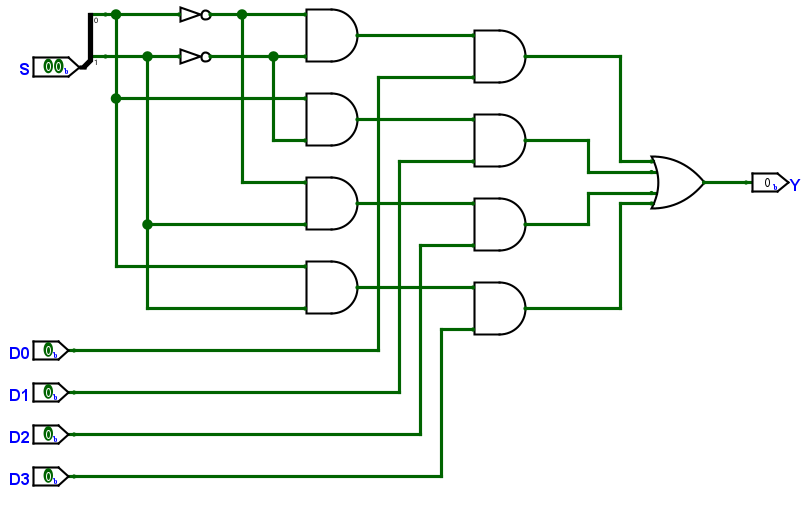
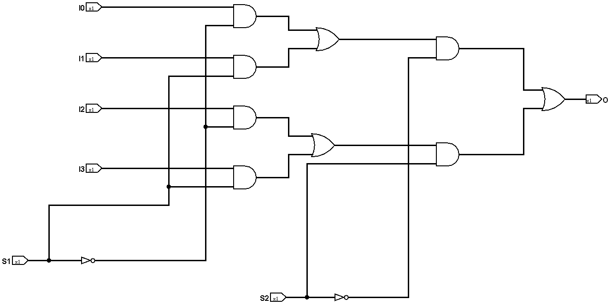

# Lab7: Multiplexer(MUX)
**MUX is a combinational logic component used to select one out of multiple input signals for output. It has multiple data input ports, a set of selection signals, and one data output port.**

## Chapter 1:One Bit 4-1 Multiplexer
### 1.1 Introduction
  
  An one bit 4-1 multiplexer means you will input an one bit signal. "4-1" means the Mux will choose one signal from your four inputs. So we will name it Mux4to1. It's easy to achieve it. Here is the circuit diagram.
      
  An simple circuit is here. The gate-cost is smaller than the former.
      
  > You can think why it is better than the former.
  