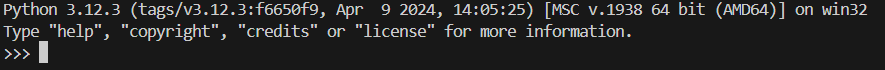
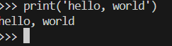
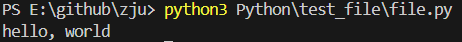
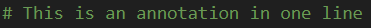
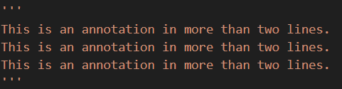

# Fundament of Python

## 1.前置小知识
### 1.1交互式语言
  首先，作为交互式语言，Python可以在命令行中直接编写。输入命令“python3”（应该所有平台都可以）就可以编写程序了。
  <br><br>
  从最熟知的“hello, world”入手，输入命令，查看输出：
  <br><br>

  其次，你也可以在命令行里运行你已经编写好的程序。
  ```
  python3
  >>>print("hello, world")            //程序代码

  python3 file.py                  //在命令行中执行
  ```
  <br><br>
  运行成功。

  如果要关闭Python，则输入```exit()```。使用Linux的小伙伴仍然可以用```Ctrl+D```来退出。

### 1.2中文编码
  Python支持中文编码，但是在远古版本需要一些条件。如果Python版本较低的同学不能显示中文，需要在开头写上```# coding=utf-8```

### 1.3换行&缩进
  Python在格式上与许多语言有个非常大的不同，就是它的格式很新奇。Python采用换行来标志一个语句的结束，而不是大部分语言中的';'。
  ```
  a = 10
  b = 11
  print(a + b)
  ```
  以上是一个计算a+b的代码。

  如果是要有多个句子和换行，例如if、for、while等的嵌套，则需要换行使对应的部分对齐。如：
  ```
  a = 1
  b = 2
  if a + b == 3:
      c = 2
      if a + c == 3:
          print(a + c)
      else:
          print("Something Error!")
  else:
      print("Something Error!")

  ```
  以上代码解释了之前的内容（if语句后面会说）。

  当然同一行其实也可以显示多条语句，只需要```;```分开就好了，但是同时会影响代码的美观性。

### 1.4注释
  注释在任何语言中都是非常重要的存在。在Python中，分为单行注释和多行注释。
  > + 单行注释使用```#```，例如：
  > + 多行注释使用```'''<content>'''```即三个单引号或者```"""<content>"""```三个双引号，同时也可用于定义多行的字符串型变量。例如：
  > <br><br>

## 2.基础语法
### 2.1输出
  作为任何语言的一大重要因素，Python的输出使必不可少的。输出代码非常简单：
  ```
  print("<content>")  or  print('<content>')        //输出字符串
  print(<variable value>)                           //输出定义的变量，不需要''或""
  print(f"{<variable value>}")                      //配合其他字符输出
  ```

### 2.2变量类型
  Python的变量类型主要可以分为三种：字符型、整形、浮点型。在这些类型中，又可以细分为单精度/双精度浮点型、长整型、短整型等。变量类型也可以相互转变。

  不同于C、C艹中的一些定义变量类型的关键字，Python中是没有这些关键字的。只需要```变量 = 变量值```，你的变量就会自动定义为相应的变量类型。

  变量的赋值基本上和其他语言一样，是通过```=```赋值。也遵循其他语言的赋值方式。不过有一点和C不一样的是，如果需要给不同变量赋值，Python用一个等号就好了。
  ```
  a, b, c = 1, 1.1, 'Arthur'
  ```
  可以分别赋值给a、b、c以1、1.1、Arthur三个值。

  除了上面三个变量类型，还有三种特殊的变量类型。

  > 1. 列表：用```变量 = [<content>]```表示。列表中的元素可变，如：a = [1, 'A', 2]，a[0] = 2是合法的语句。
  > 2. 元组：用```变量 = (<content>)```表示。元组中的元素可变，如：a = (1, 2, 'A')，a[0] = 2是非法的语句。
  > 3. 字典：用```变量 = {"key": "value"}```表示。字典中的元素可变，如：a = {'one': 'content'}

  