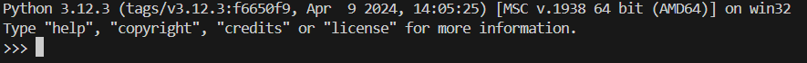
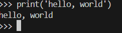

# Funderment of Python

## 1.前置小知识
### 1.1交互式语言
  首先，作为交互式语言，Python可以在命令行中直接编写。输入命令“python3”（应该所有平台都可以）就可以编写程序了。
  <br><br>
  从最熟知的“hello, world”入手，输入命令，查看输出：
  <br><br>

  其次，你也可以在命令行里运行你已经编写好的程序。
  ```
  python3 file.py
  ```
  <br><br>
  运行成功。

  如果要关闭Python，则输入```exit()```。使用Linux的小伙伴仍然可以用```Ctrl+D```来退出。

### 1.2中文编码
  Python支持中文编码，但是在远古版本需要一些条件。如果Python版本较低的同学不能显示中文，需要在开头写上```# coding=utf-8```

### 1.3换行&缩进
  Python在格式上与许多语言有个非常大的不同，就在于它的格式很新奇。Python采用换行来标志一个语句的结束，而不是大部分语言中的';'。